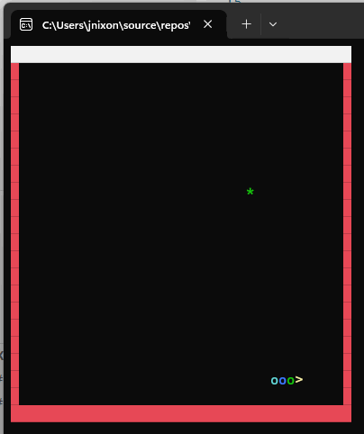

Here’s the updated file without the solution to the assignment:

# Assignment 01

## Universal Acceptance Criteria

This represents acceptance criteria that is true irrespective of assignment criteria.

1. You must understand every single line of your solution.
2. Your code must compile and run without errors.
3. You must turn in your repository URL in Brightspace.

## Assignment Acceptance Criteria

1. Your application must look like the image above.
   * It can have a more robust aesthetic, but not less. 
2. Your application must behave like the image above.
   * It can have more logic, but not less.
3. Your application must be written in class, from scratch, ready by 8:15 AM.
   * You may not use saved code snippets.
   * You may use Copilot or any other AI

### You will start with this:

   `dotnet new console -o Game -n Game`

## Grading

_Each grade category is contingent on the category above it._

### Possible points: `80`

1. (10 points) If your application builds & runs. 
2. (10 points) If your application looks like the image. 
3. (10 points) If your application behaves like the image. 
4. Your application game score (best of three attempts).
    * (50 points) First place
    * (40 points) Second place
    * (30 points) Third place
    * (20 points) Fourth place

> You may only participate in game score if your application looks/behaves correctly.

## Details

You will be writing a console-based Snake AI game that follows a precise set of requirements while ensuring smooth performance and a visually appealing experience. The game board should be 40x20 and enclosed by upper font character borders (█), which must remain visible at all times. The snake's starting position must be random, and it should begin moving immediately upon game launch without requiring user input. The snake must move continuously in the last direction, updating every 20 milliseconds, and must wrap around when reaching the screen edges instead of stopping. If the player attempts to move in the opposite direction of the current movement, the input should be ignored to prevent self-collision. The snake's movement should be efficient, and every move should be calculated as quickly as possible to avoid unnecessary delays.

A food item (*) should be randomly placed within the board, ensuring it never appears on the snake's head or body. When the snake eats the food, it should grow by one segment, and the food should move to a new valid random location. Each time the snake eats, the border must flash red for five frames to provide feedback while ensuring gameplay remains uninterrupted. The snake must be controlled by an AI, meaning it should automatically choose its direction to reach the food using the shortest path while avoiding its own tail whenever possible. The AI should never move in the opposite direction of its last move and must prioritize safe paths that don’t lead to immediate self-collision. If no completely safe path exists, the AI should choose the least dangerous option to survive as long as possible.

The snake’s head must dynamically change characters based on movement direction: > for right, < for left, ^ for up, and v for down. The snake body must be colorful, cycling through Red, Green, Blue, Cyan, and Magenta, while the head remains Yellow and the food remains Green. The snake's movement must be fluid, ensuring there are no graphical glitches or unnatural pauses. The game rendering must be optimized to prevent flickering, updating only necessary parts of the screen rather than clearing and redrawing everything. The rendering process must be structured in a way that minimizes unnecessary computations and screen writes to maximize performance. If the snake’s head collides with its own body, the game ends, and the final score (equal to the size of the snake’s tail) must be displayed. After the game ends, the program must wait for a key press (ReadKey()) before closing so the player can read their score.

To ensure smooth gameplay, all animations and effects must be non-blocking—the border flash must not cause lag, and the AI must quickly determine moves without delays. The snake's movement logic must use modular arithmetic (%) for seamless wrapping, and all calculations should be efficient to prevent slowdowns. Food placement must always be valid, meaning it must never appear on the snake, and new food locations must be generated quickly without excessive computation. The game should handle edge cases such as the snake completely filling the board, ensuring it does not crash in unexpected scenarios. Follow these instructions exactly to create a high-performance, visually engaging, and fully autonomous Snake AI game.